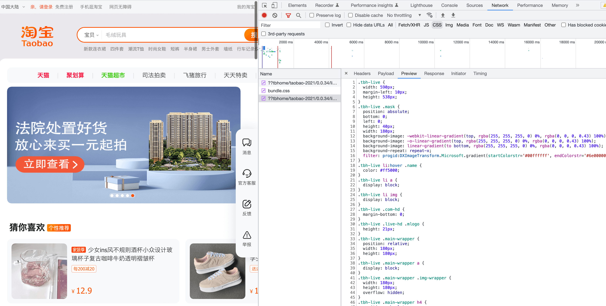
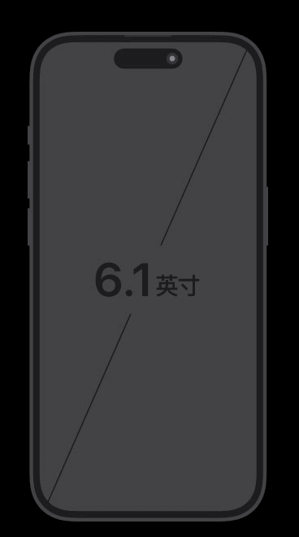
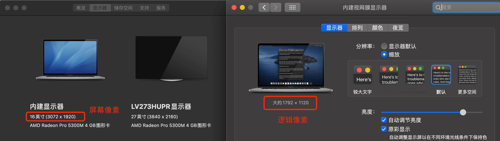
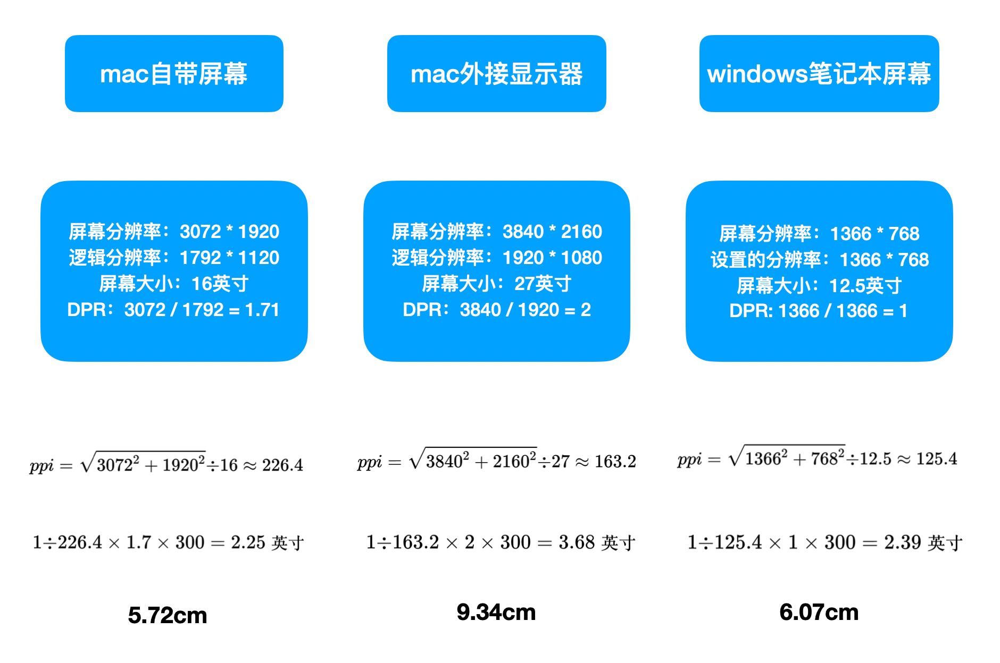

## 什么是CSS

CSS的全称是：层叠样式表（Cascading Style Sheets），是一种样式表语言，用来描述HTML或者XML文档的呈现。也就是文档在屏幕上如何被渲染。

来看一下淘宝首页的CSS实例：



**CSS代码，就是选中对应的HTML元素，然后给属性赋值，使元素展现出指定的样式**。例如：

```
/*选中了body元素*/
body {
    /*给背景色属性赋值为红色*/
    background-color: red;
}
```

## CSS中的长度尺寸单位: px

CSS是描述文档如何显示的，在显示的过程中，HTML元素的长宽、间距、字体大小等等，都需要通过长度尺寸单位来表示。我们常常会说：字体大小16像素，
间距10个像素。这里的**像素**，就是CSS中的长度尺寸单位。一个像素写作`1px`，那么`1px`在屏幕中到底占用了多少的空间呢？

### 1px等于多少厘米

我们先来看一个实测。我写了一个很简单的网页，网页中有一个HTML元素:`width: 300px`，将这个网页在不同的显示器下全屏，然后用尺子量了一下（mac上的尺子工具要花钱，所以就人工量了）。


::: warning 注意：
上述图片由于拍摄角度问题，存在些许误差。
:::

1cm大家都知道有多大。并且不管在哪儿显示，1cm就是1cm。厘米可以说是一种**绝对单位**。但是`300px`在不同的屏幕上，显示的长度却是不一样的。CSS中的像素`px`, 其实是一种`逻辑单位`。

### 绝对长度单位、屏幕尺寸以及屏幕分辨率

要彻底理解CSS中的`像素px`，先从身边的事物开始讲起。

比如，我们经常会听到，iphone14的屏幕尺寸就是6.1英寸。英寸是英国那边的长度单位。``1英寸 = 2.54厘米``。也就是说，iphone14的屏幕尺寸是：
``6.1 * 2.54 = 15.494厘米``。像厘米，英寸这样的长度单位，叫做**绝对长度单位**。

屏幕尺寸是如何计算的呢？其实是计算的屏幕对角线的长度。



那么，屏幕分辨率又是怎么回事呢？

**屏幕分辨率**：指在横纵向上的像素点数，单位是px，`1px=1个像素点`。一般以纵向像素*横向像素来表示屏幕的分辨率，如``1960*1080``。

::: warning 注意：
这里的 像素px 与 CSS中的像素px ，不一定相等。
:::

像素点其实就是一个一个的小方块，是屏幕展示画面的最小单位。下面这张图，可以比较形象的表示像素点：


iphone14的像素为：``2532px * 1170px``。其对角线的像素点个数为：


每英寸内包含的像素点个数为：`2789 ➗ 6.1 ≈ 460`;

这里的`每英寸内包含的像素点个数`被称为**屏幕像素密度(pixels per inch)**，简写为：**ppi**。在计算机屏幕上，**ppi** 经常也被称为：**dpi**(dots per inch).

ppi越高，我们通过屏幕肉眼可见的画面就越清晰。

Chrome针对不同的ppi，对显示屏幕进行了分类,


Apple直接将屏幕分为了非高清屏、高清屏、超高清屏。我们平时所说的2k屏，4k屏，就是分辨率达到了特定值的屏幕。

### 设备像素比(DPR)与CSS中的px

在web开发中，有一个设备像素比(devicePixelRatio)的概念，简称为：`DPR`。在浏览器中（主要是移动端），可以通过``window.devicePixelRatio``来获取这个值。 这个值是像素大小的比率：一个 CSS 像素的大小与一个物理像素的大小的比。 简单来说，它告诉浏览器应使用多少屏幕实际像素来绘制单个 CSS 像素。CSS像素是一个逻辑上的概念。

::: warning 注意：
桌面端电脑的DPR值，是可以自定义的。``window.devicePixelRatio``并不能获取准确的DPR值。
Windows电脑的DPR值，可以通过修改屏幕分辨率设置，一般情况下为1。
MAC OS的DPR值，可以通过系统的显示器设置查看。

:::

假设在`dpr=2`的情况下，我们在CSS中的`1px`，在屏幕上，就需要用2个物理像素来表示。结合之前的内容, 

```
∵ ppi = 每英寸内包含的像素点个数 
∴ 一个物理像素实际宽度 = 1 / ppi。
∴ 300px宽的HTML元素实际的宽 = 一个物理像素实际宽度 * 300 * DPR = 1 / ppi * 300 * DPR
```

下面，我们来试着回答一开始的问题，1px到底等于多少厘米。下图列出了我电脑的配置以及计算过程：



可以看到，计算出来的过程与上面用卷尺量出来的长度是相符合的。

::: tip 提示
CSS中除了px可以表示长度以外，还有`em`, `rem`等。而移动端中的尺寸计算，还涉及到一个重要的概念：```viewpoint```。这些将在后面的内容中详细介绍。
:::

### 小结

我们生活中提到的像素与web开发中的提到的像素是不同的。CSS中的1px最终表现出来，到底有多大的尺寸，取决于屏幕本身的分辨率和屏幕的分辨率设置。除了屏幕，我们平时也会说一个图片的大小是m像素 * n像素，这是逻辑像素。而图片的真实尺寸，是等于`图片像素值 / 图片的dpi`。

## CSS中的颜色

在CSS中表示颜色，有三种方法：**关键字**，**RGB**，**HSL**.

### 关键字表示颜色

可以直接用一个颜色的英文单词来表示一个颜色。例如：red, blue, green等等。例如：

```
/*背景色为蓝色*/
background-color: blue;
/*背景色为海蓝色*/
background-color: Aquamarine;
/*完全透明的颜色，即该颜色看上去将是背景色*/
background-color: transparent;
```
颜色的关键词有不少，但是某些未知的关键字浏览器无法识别。除了常见的颜色，一般不建议使用关键字来表示颜色。

### RGB表示颜色
RGB，即 red-green-blue (红，绿，蓝)。红绿蓝是色光三原色，通过这三种颜色的组合，可以叠加出任何的颜色。

**其中一个格式为：```rgb(红色数值，绿色数值，蓝色数值)```**
每一种颜色的数值的取值范围为：0 - 255。数字越大，表示所占比例越重。

```
/* 背景为红色 */
background-color: rgb(255, 0, 0);
/*背景色为白色*/
background-color: rgb(255, 255, 255);
/*背景色为灰色*/
background-color: rgb(111, 111, 111);
```
带透明通道的格式为：``rgba(红色数值，绿色数值，蓝色数值，透明度)``。透明度的取值为0到1之间的小数或者百分比。1表示完全不透明。

```
/* 背景为黑色，透明度为0.1 */
background-color: rgba(0, 0, 0, 0.1);
```
**另外一个格式为：```#RRGGBB(AA)```**
每一位都是16进制数即0-f。
```
/* 背景为红色 */
background-color: #ff0000;
/* 背景为红色, 上面写法的简写 */
background-color: #f00;
/* 背景色为黑色，透明度为0.06 */
background-color: #0000000f;
```
RGB表示颜色是最常用的方法了。当带有透明度的时候，一般采用`rgba(红色数值，绿色数值，蓝色数值，透明度)`的格式，比较方便。

### HSL表示颜色

颜色也可以使用 hsl() 函数符被定义为色相 - 饱和度 - 亮度（Hue-saturation-lightness）模式。加上透明度即为：hsla()

```
h: 定义色相 (0 到 360) - 0 (或 360) 为红色, 120 为绿色, 240 为蓝色
s: 定义饱和度; 0% 为灰色， 100% 全色
l: 定义亮度 0% 为暗, 50% 为普通, 100% 为白
a: 透明度。0（透完全明） ~ 1（完全不透明）
```

```
/* 背景色为绿色 */
background-color:hsl(120,100%,50%);
/* 背景色为绿色，透明度为 0.5 */
background-color:hsl(120,100%,50%, 0.5);
```

## 总结

本文主要介绍了CSS中的尺寸单位px和颜色的表示方法，这是前端样式的基础。有很大一部分CSS属性都是通过设置尺寸或者颜色来工作的。下面，将介绍如何使用CSS选中一个HTML元素。


