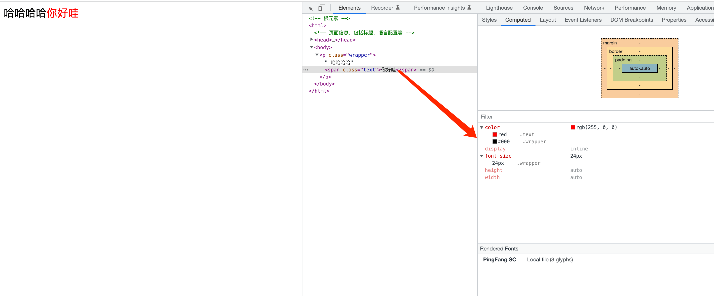

## 什么是CSS选择器

CSS选择器用来指定网页上需要进行样式化的元素。先选中特定的HTML元素，然后设置该元素的样式。语法：

```
选择器：{
    样式属性：属性的值
}
```

## CSS选择器的类型

在前面的文章中，你也许已经见过CSS选择器了。例如：
```
body {
    background-color: red;
}
```
这段代码的意思就是，设置body元素的背景页为红色。其中，body 选中了HTML文档中的body元素，`background-color: red`指定设置背景色为红色。最常见的CSS选择器有：
类型选择器、类选择器、ID选择器、属性选择器、伪类选择器、后代选择器、子代选择器等等。

- 类型选择器

上面的body就是一个类型选择器，指定选中的HTML元素的种类。
```
/* 选中页面中所有的h1元素 */
h1 {
    font-size: 14px;
}
/* 选中页面中所有的a元素 */
a {
    color: #000;
}
```

- 类选择器
通过元素的类名，来选中元素
```
/* 选中页面中所有带有 title 类的元素 */
.title {
    ...
}
```

- ID选择器
通过元素的ID，来选中元素。
```
/* 选中页面中ID为submit的元素 */
#submit {
    ...
}
```

- 属性选择器
通过元素的属性，来选中元素.
```
/* 选中页面中带有属性data-active属性且data-active="true"的元素 */
[data-active="true"] {
    ...
}
```

- 伪类选择器
对某些元素的特殊状态进行样式化。
```
/* 鼠标悬停到a元素上时的样式 */
a:hover {
    ...
}
```

- 后代选择器
组合选择器。选择符合条件的元素的特定后代元素
```
/* 选中article元素后代中的P元素 */
article p {
    ...
}
```

- 子代选择器
组合选择器。选择符合条件的元素的特定儿子元素
```
/* 选中article元素儿子元素中的P元素 */
article > p {

}
```

- 相邻兄弟选择器
组合选择器。当第二个元素紧跟在第一个元素之后，并且两个元素都是属于同一个父元素的子元素，则第二个元素将被选中.
```
/* img后面紧跟着的p元素将被选中 */
img + p {
  ...
}
```

- 通用兄弟选择器
组合选择器。当两个元素处于统一层级时，第一个元素后的所有第二个元素被选中.
```
/* img元素后的所有.text类元素都被选中 */
img ~ .text {
    ...
}
```

## 选择器列表

考虑以下场景，有两种元素，我需要设置同样的字体颜色，如：
```
.text {
    color: red;
}
.error {
    color: red;
}
```
这种情况下，可以将两个选择器用逗号链接起来，如下：
```
.text,
.error {
    color: red;
}
```

## 样式的继承
对于一些特定的样式属性，如`font-size`等，如果我们没有显式的去设置，那么该样式的值将会继承其父元素的样式。若父元素也未进行设置，则会继续查找父元素的父元素，直到根元素为止。如：
```
/* HTML代码 */
<p class='wrapper'>
    哈哈哈哈<span class='text'>你好哇</span>
</p>

/* CSS代码 */
.wrapper {
    color: #000;
    font-size: 24px;
}
.text {
    color: red;
}
```
`.text`是`.wrapper`的子元素。我们没有显式的设置`.text`的`font-size`大小，那么其将继承`.wrapper`的字体大小。最终`.text`的`font-size`也为24px; `color`也是一个继承属性，但是因为我们显式设置了`.text`的`color`属性，因此其字体颜色为红色而不是黑色。



常见的可继承的样式属性有：`font-size`, `font-family`, `text-align`, `line-height`, `color`等。

::: warning 注意：
- 如果整个页面都没有对样式进行显式设置，那么将会展现浏览器的默认样式。
- 某些情况下，可继承属性也无法继承，因为浏览器有特定的样式，如：a元素的字体颜色就无法继承其父元素的字体颜色。浏览器对a元素的字体颜色有特殊处理。
:::

那么问题来了，如果对于同一个元素的同一个样式属性，我前后设置了两次，并且两次设置的值不一样，那么最终的效果是怎样的呢？这涉及到样式的优先级问题，将在下一章进行讲述。


