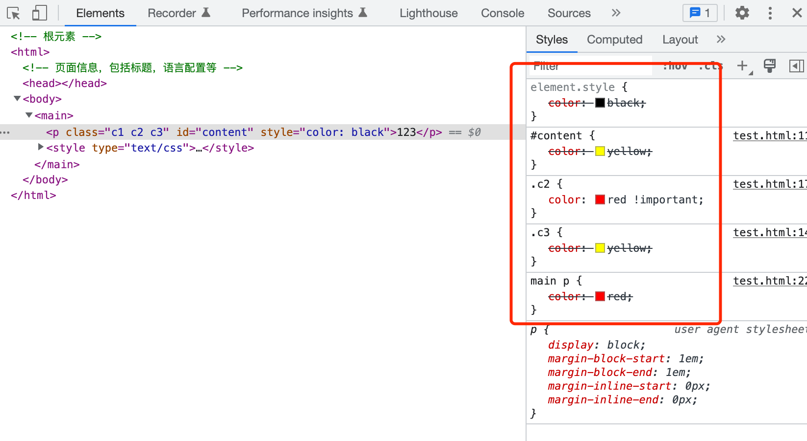

## 设置HTML元素的样式
可以通过两种方式来设置HTML元素的样式。
- 内联样式：
在HTML元素的style属性中设置样式，如：
```
<p style='color: red;font-size: 13px'>123</p>
```
- CSS设置样式
通过CSS选择器选中HTML元素，然后设置样式。如：
```
// CSS代码
p {
    color: red;
    font-size: 13px;
}
// HTML代码
<p>123</p>
```

## 样式冲突
针对同一个HTML的同一个CSS属性，先后设置了不同的样式值，产生了冲突。如：
```
// CSS代码
p {
    color: red;
}

.content {
    color: black;
}

// HTML代码
<p class='content'>123</p>
```
产生样式冲突时，浏览器会遵循规则，决定最终被采用的是哪一个规则。

## 样式的优先级

CSS的选择器是有优先级的。一个选择器的优先级可以说是由三个不同的值（或分量）相加，可以认为是百（ID）十（类）个（元素）——三位数的三个位数：

ID选择器：选择器中包含 ID 选择器则百位得一分。
类选择器：选择器中包含类选择器、属性选择器或者伪类则十位得一分。
元素选择器：选择器中包含元素、伪元素选择器则个位得一分。

::: warning 注意：
通用选择器（*）、组合符（+、>、~、' '）和调整优先级的选择器（:where()）不会影响优先级。
:::

最终浏览器会计算出选择器的"得分"，来决定最后使用哪一个选择器的属性。

例如：
```
// HTML代码
<main>
    <p class='c1 c2 c3' id='content'>123</p>
</maim>

// CSS代码
/* 优先级 1-0-0，生效✅ */
#content {
    color: white;
}
/* 优先级 0-2-0 */
.c1.c2 {
    color: blue;
}
/* 优先级 0-1-0 */
.c3 {
    color: yellow;
}
/* 优先级 0-1-1 */
p.c3 {
    color: black;
}
/* 优先级 0-0-2 */
main p {
    color: red;
}
```
这里需要注意的是，低级别的选择器优先级无法覆盖高级别的选择器优先级。如10个元素选择器的优先级，也比不过1个类选择器的优先级。10个, 100个类选择器的优先级，也比不过1个ID选择器的优先级。

当两个选择器的优先级一致时，后面的会覆盖前面的。例如：
```
// HTML代码
<main>
    <p class='c1 c2 c3' id='content'>123</p>
</maim>

// CSS代码
/* 优先级 0-1-0 */
.c2 {
    color: red;
}
/* 优先级 0-1-0。优先级相同，位置靠后，生效✅*/
.c3 {
    color: black;
}
```

当我们采用内联的方式声明样式时，将以内联的样式为主。例如：
```
// HTMl代码
<main>
    /* 内联样式生效✅ */
    <p class='c1 c2 c3' id='content' style="color: red">123</p>
</maim>

// CSS代码
#content {
  color: yellow;
}
```

还可以通过增加`!important`关键字来提升CSS选择器的优先级。

```
// HTMl代码
<main>
    <p class='c1 c2 c3' id='content' style="color: red">123</p>
</maim>

// CSS代码
#content {
  /* 生效✅ */
  color: yellow !important;
}
```

CSS的优先级在日常开发中，还是比较重要的。我们可以在chrome的dev-tool中清晰得看到样式的优先级情况。


