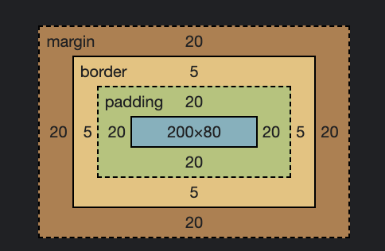
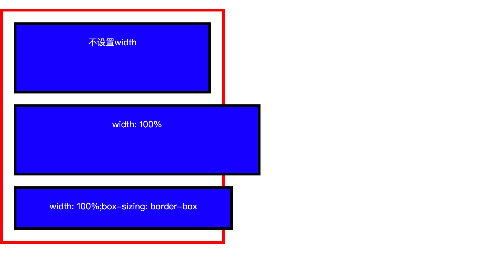

### CSS盒模型概况

HTML进行布局的时候，元素都会被表示为一个一个的矩形的"盒子"。CSS 决定这些盒子的大小、位置以及属性。每一个盒子包含了四个部分：

**内容(content)、内边距(padding)、外边距(margin)、边框(border)**。

在标准的盒模型下：


例如以下样式代码：

```
.container {
    width: 200px;
    height: 80px;
    border: 5px;
    margin: 20px;
    padding: 20px;
}
```


既然有标准的盒模型，那不标准的盒模型呢？盒模型标准可以由css属性`box-sizing`来控制。`box-sizing`有两种取值：

- `content-box`(默认值，标准盒模型)。
- `border-box`(怪异盒模型)。

依然是上面的样式代码，如果我们设置了`box-sizing: border-box`，最终的盒子展示出来为：


通过上下两个盒子的对比，可以看到，依然是`width: 200px`, 在设置了`box-sizing: border-box`后，这时盒子的总宽度（内容+内边距+边框）= 200，而内容区域的宽度则变为了

```
200 - 20 * 2 - 5 * 2 = 150
```

注意，外边距并没有受到影响。我们可以根据需要，灵活的设置HTML元素的盒模型。

- 在标准盒模型下(`box-sizing: content-box`, 默认)，HTML元素占据的总宽度 = width + padding + border + margin
- 在怪异盒模型下(`box-sizing: border-box`)，HTML元素占据的总宽度 = width + margin

### width: 100% 到底表示多长

对于**块级**的HTML元素而言, 经常会遇到设置其长度的场景，这是比较容易混淆的一个地方，因此专门拿出来讲一下。假设除了width以外的其他的CSS属性如下：

```
height: 80px;
border: 5px solid black;
margin: 20px;
padding: 20px;
background-color: blue;
```

如果我们不指定元素的width（相当于`width: auto`），那么元素会默认占满整个父元素，不多不少，所占区域宽度为: 父元素宽度。

如果我们指定了`width: 100%`，那么元素的内容区域将会继承其父元素的宽度，加上padding、bordr、margin后，元素会撑开页面，所占区域宽度为：父元素宽度 + padding + bordr + margin。

如果指定了`width: 100%; box-sizing: border-box`, 元素的整个宽度为： 父元素宽度 + margin。



### padding 和 margin 的百分比取值

padding, margin 都可以看做是一个简写属性，表示了`上`，`右`，`下`，`左`（严格按照此顺序）四个方向的取值。例如：

```
padding: 10px; 

等价于：

padding-top: 10px;
padding-right: 10px;
padding-bottom: 10px;
padding-left: 10px;

-----------------

padding: 10px 20px; 

等价于：

padding-top: 10px;
padding-bottom: 10px;
padding-left: 20px;
padding-right: 20px;

-----------------

padding: 10px 20px 30px; 

等价于：

padding: 10px 20px 30px 20px;

等价于：

padding-top: 10px;
padding-right: 20px;
padding-bottom: 30px;
padding-left: 20px;

```

padding 和 margin 的取值，不仅可以使用具体的长度，也可以使用**百分比**。例如：```padding: 10%```。

这里需要特别注意的是，padding 和 margin 的百分比取值，是参照于父元素的**宽度**，而不是高度，这是比较容易出错的地方。

```
// 父元素宽度的10%
padding-top: 10%;

// 父元素宽度的20%
margin-top: 20%；
```

而`height: 10%`，则是相对于父元素**高度**的10%。

我们可以利用`padding-top`百分比取值的规则，很容易的就可以实现：**在父元素高度未确定的情况下，按照一定的比例显示图片**。

```
// HTML代码
<div class='parent'>
    <div class='child-img'></div>
    <div class='child-p'>hello world</div>
</div>

// CSS代码
.parent {
    width: 200px;
    border: 5px solid red;
}

.child-img {
    // 按照16:9的比例显示图片。9 / 16 = 0.5625
    padding-top: 56.25%;
    background-image: url('./img.png');
    background-size: cover;
}

.child-p {
    // 父元素宽度的50%
    margin-top: 50%;
}
```


关于border属性，其实还可以用来画三角形，在特定的场景下挺有用的。详情可以参考这篇文章：[传送门](https://segmentfault.com/a/1190000005715074)

本文介绍了CSS盒模型以及一些应用点。下一小结将介绍CSS中的布局规则。