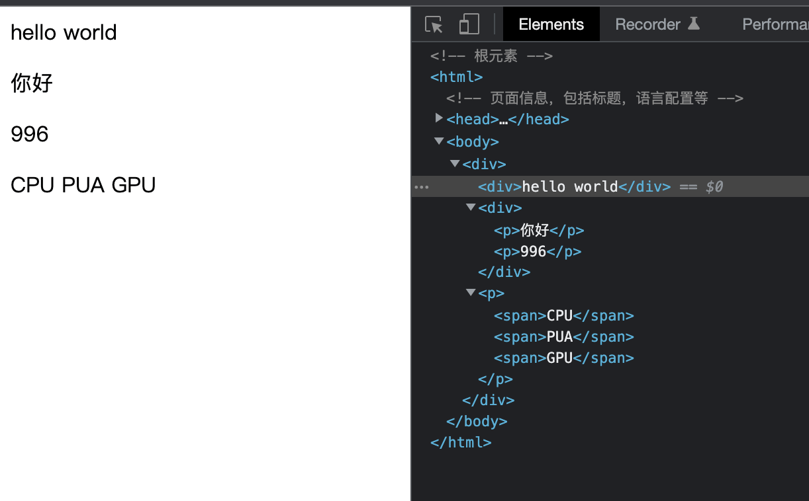
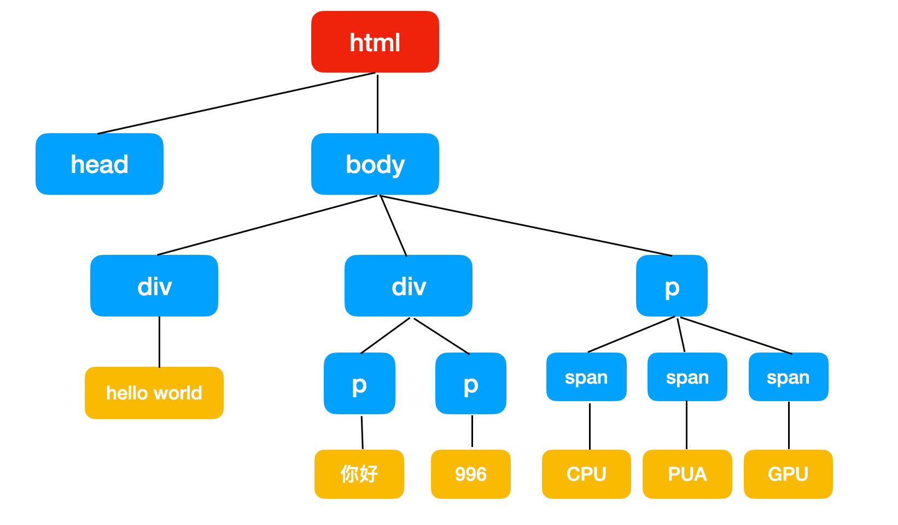
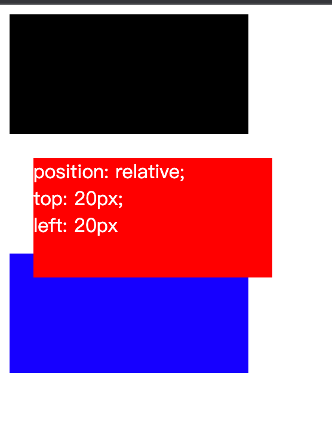
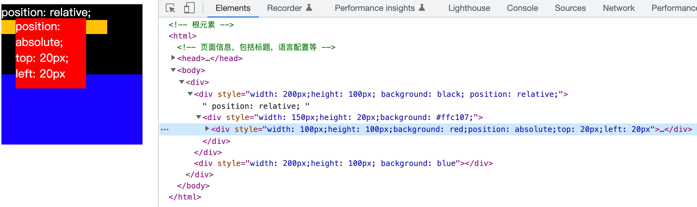
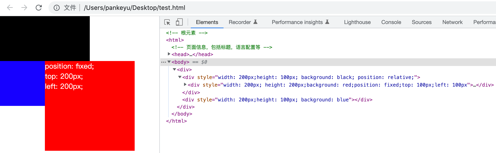
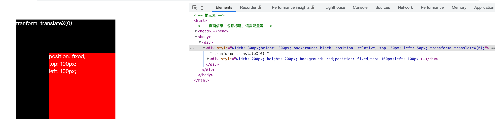
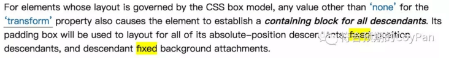
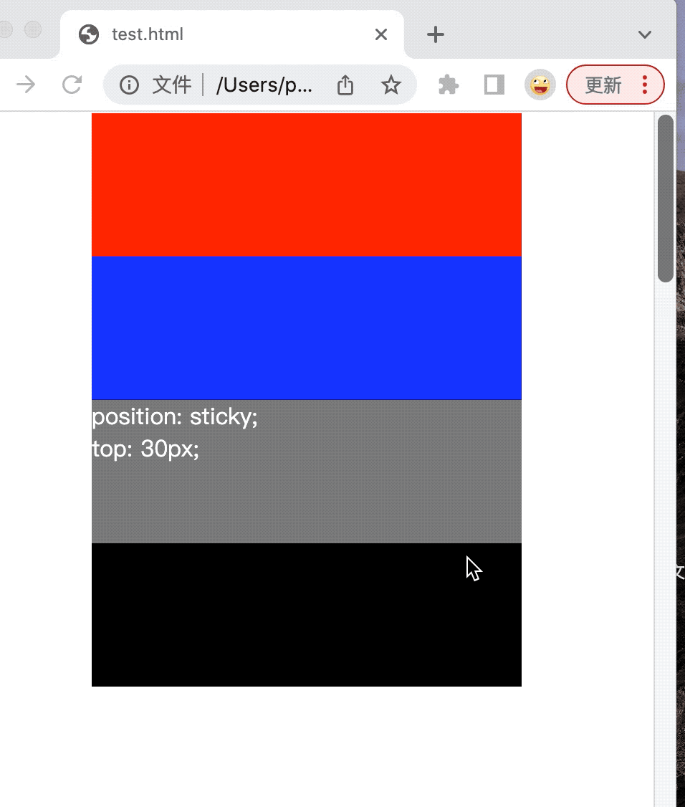
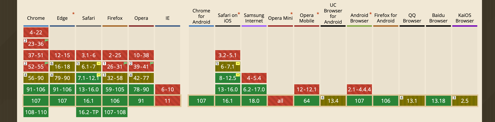

## 正常布局

在开发一个页面的时候，如果我们不特定用CSS去控制页面元素的布局，那么，浏览器会根据页面元素的属性、种类，从左到右（内联元素），从上到下（块级元素），进行流式排布。
举个例子：

HTML中的所有元素，构成了一颗"树"。每一个HTML元素，都可以看成是树的一个节点。HTML元素是树的根节点。以上面的代码为例，其形成的树，可以如下表示：

除了跟节点和叶子节点之外，每一个节点都有祖先节点，后代节点。直接祖先节点为父节点，直接后代节点为儿子节点。注意，每段文本，其实是一个文本节点。

## position属性

position，顾名思义，就是定位。它能够让元素从它原本应该在的位置（正常布局）移动到另外一个位置。

常见的position属性一共有5种：static, relative, absolute, fixed, sticky.

### position: static 静态定位

这就是一个默认值。表示就是元素放在它原本应该在的位置，没有什么特殊的地方。就不做过多介绍了。

### position: relative 相对定位

允许我们相对于元素在正常的文档流中的位置移动它。设置`position: relative`后，我们还可以设置元素的`top`、`left`、`right`、`bottom`等属性，来调整其位置。

**红色的方块的左上角相对于其原本位置的左上角，水平方向上偏移20px，竖直方向上被偏移了20px**。相对定位的元素，并不会影响它的相邻的元素，它只是相对于**自己本来的位置**进行偏移。

### position: absolute 绝对定位

使元素脱离正常的文档流，单独进行定位。定位参照的是第一个**非static定位**的祖先元素。若祖先元素均没有设置非static定位，则相对于HTML根元素定位。

红色方块是黄色方块的子元素，但是黄色方框是static定位，而黄色方块的父元素黑色方块是relative定位，因此，红色方块相对于黑色方块进行定位。红色方块的左上角相对于黑色方块的左上角，水平方向偏移20px，竖直方向偏移20px。由于红色方块脱离了文档流，因此不会影响到下面的蓝色方块的位置。

### position: fixed 固定定位

元素相对浏览器视口固定。

这里需要注意的是，并非所有情况下，fixed都是相对于浏览器视口进行定位。**更准确的说，如果`position: fixed`的某一个祖先元素设置了`transform`属性，则相对于该祖先元素进行定位，否则，相对与视口进行定位**。

这是W3C的规范规定的：

在平时的项目开发中，这一点需要留一个心眼。否则可能会出现不符合预期的布局表现。

### position: sticky 粘性布局

这是一个比较新的布局，当一个元素被指定了position: sticky时，它会在正常布局流中滚动，直到它出现在了我们给它设定的相对于容器的位置，这时候它就会停止随滚动移动，就像它被应用了position: fixed一样。

当前sticky的浏览器支持情况如下：

## 小结

本文主要介绍了css布局的一个关键属性：`position`。这在项目开发中是使用很多的，需要熟练掌握。关于`position:fixed`需要特别留意。下一章将介绍 `display` 属性。

