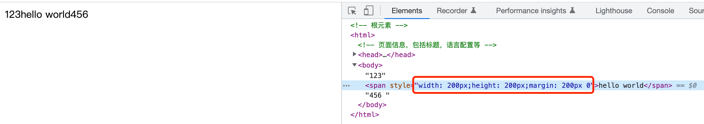
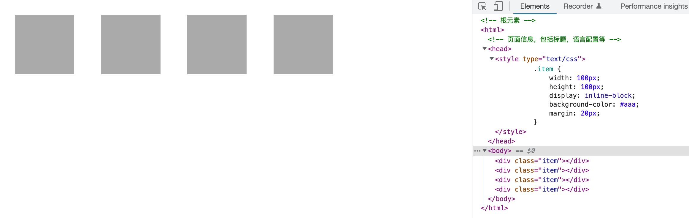
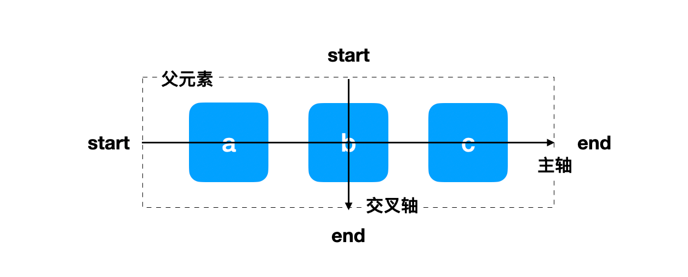
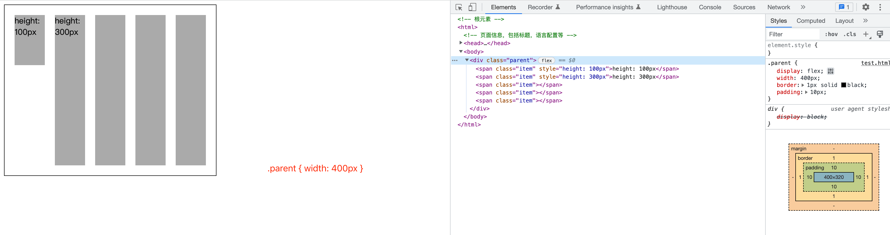
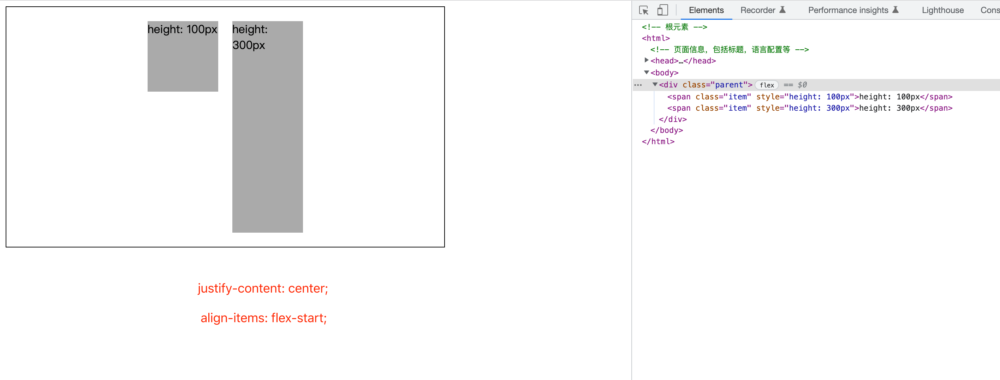
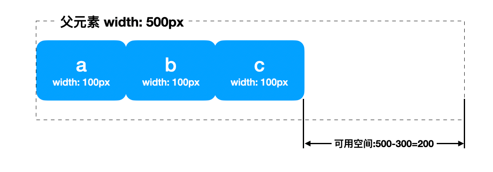
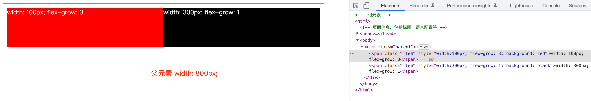
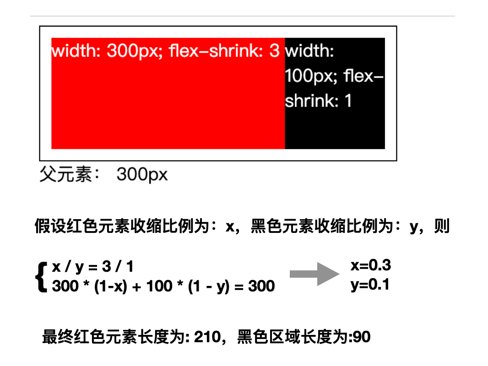

## display属性
CSS中的display属性用于设置元素是否被视为块级元素或内联元素，以及作用于子元素的布局。常见的display取值有：
```
display: block;
display: inline;
display: inline-block;
display: flex;
display: inline-flex;
display: grid;
display: inline-grid;
```
## block、inline、inline-block

- block: 将元素视为块级元素
- inline: 将元素视为内联元素
- inline-block: 将元素视为内联块级元素

在之前的文章中，已经简单介绍了[内联元素和块级元素](https://coypan.info/web/HTML/02-HTML%E5%85%83%E7%B4%A0%E5%88%86%E7%B1%BB%E4%BB%A5%E5%8F%8A%E5%B5%8C%E5%A5%97%E8%A7%84%E5%88%99.html)。

内联元素是无法设置`width`,`height`,`margin-top`,`margin-bottom`等属性的。



如果我们想让元素排列成一行，又可以设置其宽高等属性，就可以使用`display:inline-block`，让其同时拥有块级元素和内联元素的特性。



注意，`img`元素，默认就是`inline-block`属性的。

## display: flex

`display:flex`。flex是弹性盒布局，用来控制子元素的布局方式。

### flex布局的主轴和交叉轴

flex布局有一个基础，就是会形成一个主轴和交叉轴。



由于网页排版的时候，默认就是从左到右，从上到下的，flex布局的时候，主轴默认是从左到右的水平方向。确定主轴方向后，交叉轴和主轴垂直，默认是上从往下的数值方向。
可以通过`flex-direction`属性来确定主轴的方向。主轴方向确定后，交叉轴方向按照上图进行相应的旋转即可得知。

```
flex-direction: row; // 默认属性，主轴从左往右 →
flex-direction: row-reverse; // 主轴方向从右往左 ← 
flex-direction: column; // 主轴方向从上往下 ↓ 
flex-direction: column-reverse; // 主轴方向从上往下 ↑
```
主轴开始的位置可以叫做主轴起始线，主轴结束的位置，可以叫做主轴终止线。

### flex容器、flex元素以及对齐方式

设置了`display: flex`的元素为flex容器，而flex容器的子元素为flex元素。flex容器和元素都会有以下的默认表现：

- flex元素按照主轴的方向依次排列
- 不管flex元素是否设置了宽度，元素不会在主维度方向拉伸，但是可以缩小
- flex元素被拉伸来填充交叉轴大小
- flex容器的`flex-wrap`属性为`nowrap`，即默认不换行。

以默认情况（`flex-direction: row`)为例，

主轴（水平方向）上的情况为：flex元素从左往右一次排列。如果flex元素的宽度之和大于了flex容器的宽度，flex元素的宽度会被压缩。

对称轴（竖直方向）上的情况为：flex容器的高度为其声明的高度，如果没有声明高度，则高度为flex元素中最高的那一个。flex容器的高度确定后，没有声明高度的flex元素会被拉伸到flex容器的高度。



`justify-content`: 设置flex元素在主轴上的对齐方式。

`align-items`: 设置flex元素在交叉轴上的对齐方式。




### flex: 1

为了更好的控制flex元素的行为，经常会看到一个写法：`flex: 1`。这其实是一个简写，对应着以下三个属性：`flex-grow`, `flex-shrink`, `flex-basis`.
```
flex: 1

等价于

flex-grow: 1;
flex-shrink: 1;
flex-basis: 0%;
```
在考虑这几个属性的作用之前，需要先了解一下 **可用空间 available space** 这个概念。这几个 flex 属性的作用其实就是改变了 flex 容器中的可用空间的行为。



可用空间即为flex元素排列完成后，flex容器主轴上剩余的空间。如果没有flex元素，则可用空间的值即为flex容器的宽度。flex属性可以控制flex元素如何使用剩余空间。

- flex-basis

flex-basis 定义了元素的空间大小, 默认为auto。如果没有给元素设定尺寸，flex-basis 的值采用元素内容的尺寸。在flex容器中，元素占用的空间以flex-basis为准。如果同时设置了flex-basis和元素的尺寸（例如 width），那么将以flex-basis为准。但是，如果我们设置了max-width，但是 flex-basis 又超出了这个max-width，那么最终会以max-width为准。


- flex-grow

flex-grow 若被赋值为一个正整数，flex 元素会以 flex-basis 为基础，沿主轴方向增长尺寸。这会使该元素延展，并占据此方向轴上的可用空间。每一个flex元素按照flex-grow的值来确认占据可用空间的比例。



如上图，父元素宽 800，红色元素宽100，黑色元素宽400。可用空间为：800 - 100 - 300 = 400；红色元素和黑色元素的flex-grow比例为：3 / 1。因此，红色元素分得剩余空间的4分之3，为：400 * (3 / 4) = 300; 黑色元素分得4分之1，为 400 * (1 / 4) = 100。最终，红色元素宽度为：100 + 300 = 400，黑色元素宽度为：300 + 100 = 400.

- flex-shrink

flex-shrink属性是处理 flex 元素收缩的问题。如果我们的容器中没有足够排列 flex 元素的空间，那么可以把 flex 元素flex-shrink属性设置为正整数来缩小它所占空间到flex-basis以下。这个的计算比flex-grow略微复杂一些，看下面的例子：



在平时的项目中，如果不想让某个flex元素被压缩，则需要设置flex-shrink: 0。

`display: inline-flex`，可以让某元素同时具备内联元素和flex容器的特性。

## display: none

`display: none`可以控制一个元素不会渲染出来。但是要注意的事，`display: none`的元素会被布局流忽略，但不会从DOM中移除。

## display: grid

相对于flex的一维布局，grid的二维布局更加强大。但由于篇幅原因以及我平时在开发中使用不多、熟练度不够，`display: grid` 就不多做介绍了。推荐[这篇文章](https://developer.mozilla.org/zh-CN/docs/Web/CSS/CSS_Grid_Layout/Basic_Concepts_of_Grid_Layout)
