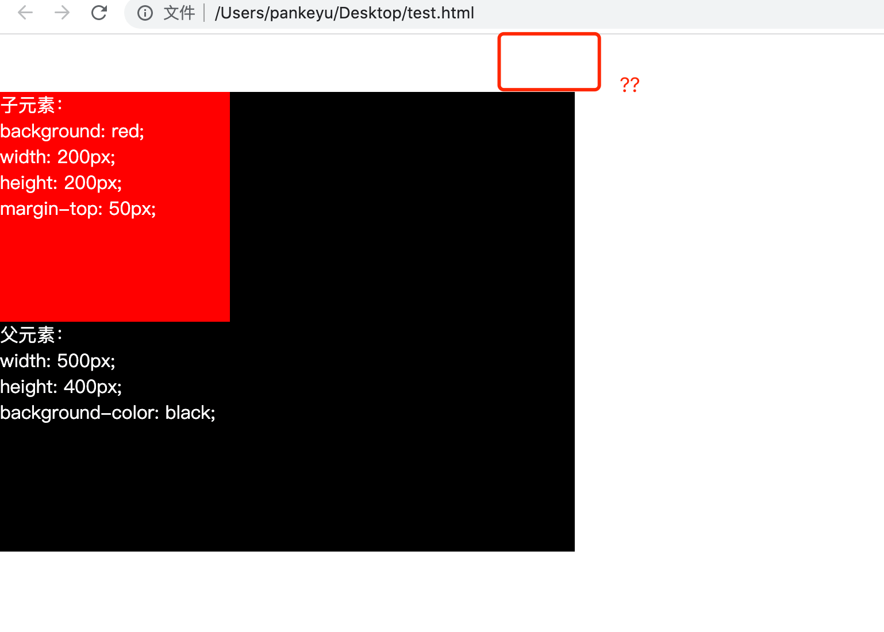
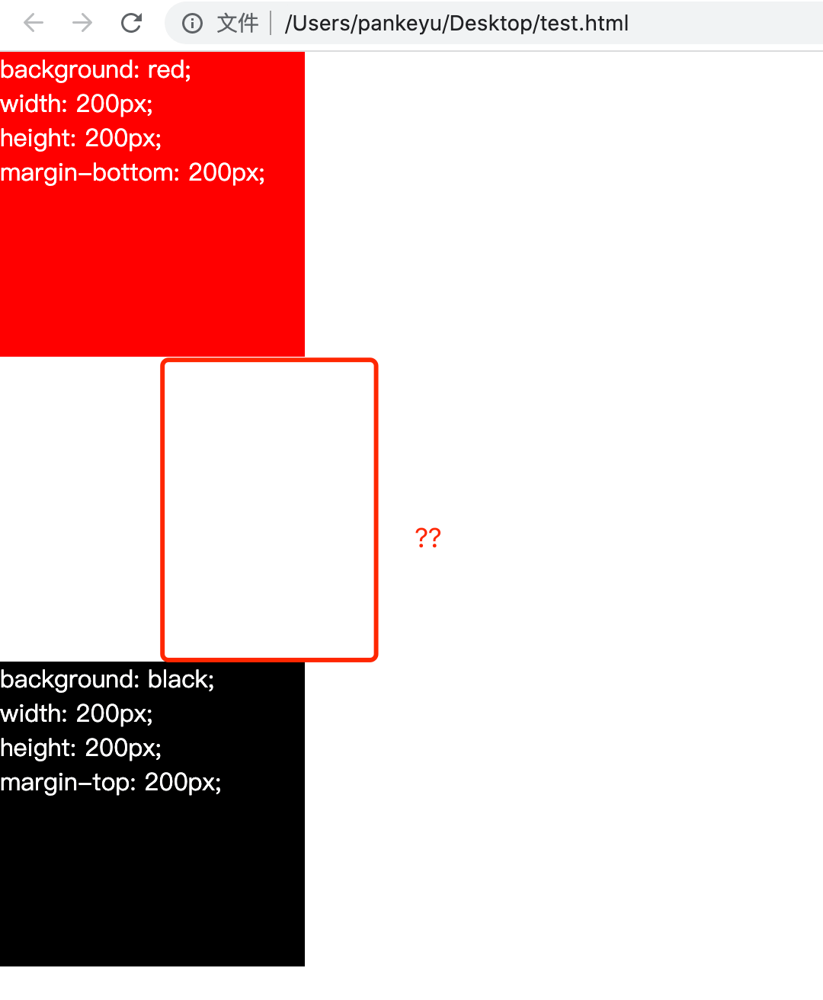
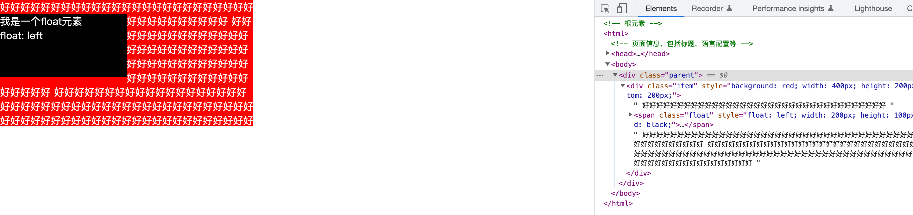
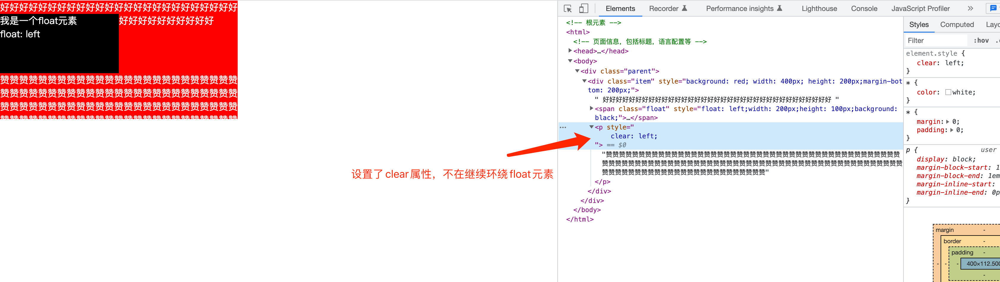
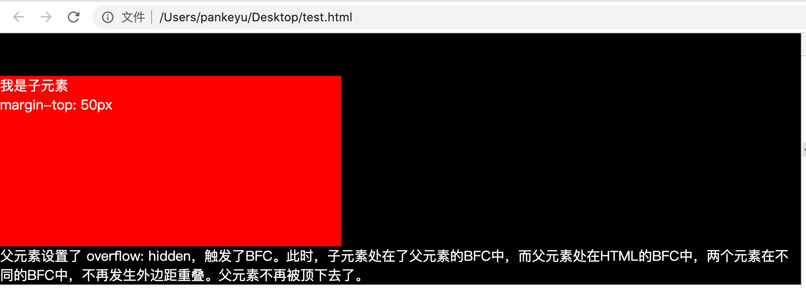
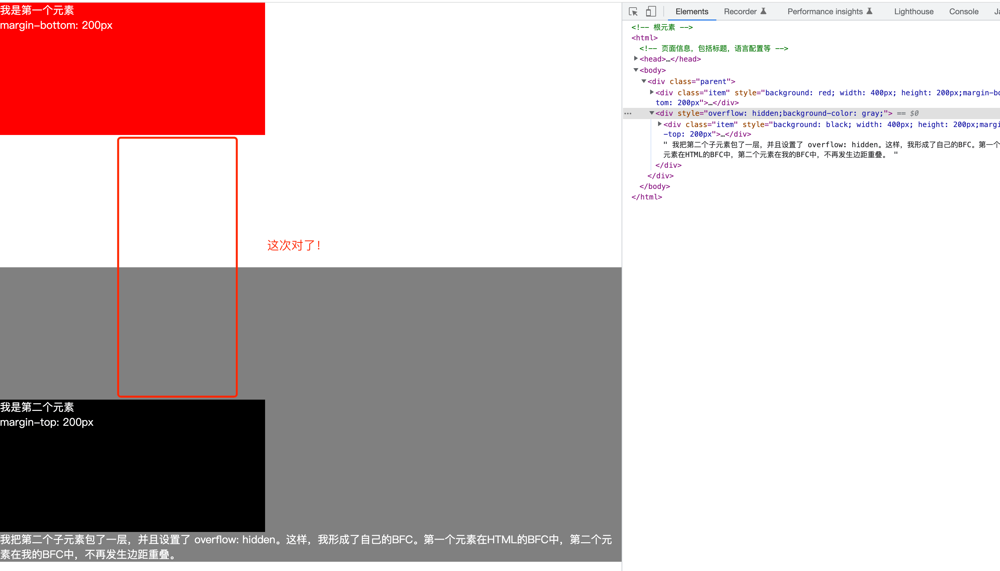
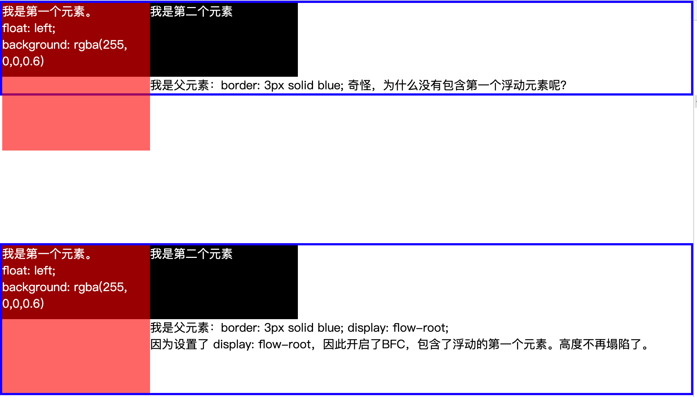
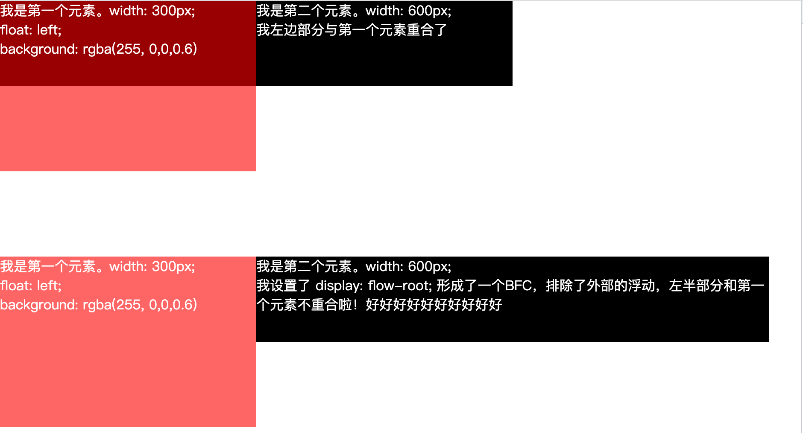

## 不符合预期的布局

你可能曾经遇到过下面的场景：

明明只设置了子元素的`margin-top: 50px`, 为什么会把父元素直接顶下去了呢？

第一个元素设置了`margin-bottom: 200px`，第二个元素设置了`margin-top: 200px`，为啥两个元素看起来只间隔200px呢？

要解决上面的问题，就得提到一个概念了：**BFC**。

**BFC，块格式化上下文（Block Formatting Context)，是块级盒子的布局过程发生的区域，也是浮动元素与其他元素交互的区域**。

## 浮动元素

BFC的定义中，涉及到了浮动元素。在之前的文章中，已经介绍了CSS布局的正常文档流以及绝对定位布局。这里介绍一下浮动元素。

浮动元素应沿其容器的左侧或右侧放置，允许文本和内联元素环绕它。该元素从网页的正常文档流中移除，尽管仍然保持部分的流动性。通过CSS的`float`属性，可以设置一个元素为浮动元素。

可以看到，浮动元素被文本和内联元素环绕了。同时需要注意的是，使用`float`意味着使用块布局，会将内联元素当做块级元素来处理布局。当一个元素浮动之后，它会被移出正常的文档流，然后向左或者向右平移，一直平移直到碰到了所处的容器的边框，或者碰到另外一个浮动的元素。

有时，你可能想要强制元素移至任何浮动元素下方。比如说，你可能希望某个段落与浮动元素保持相邻的位置，但又希望这个段落从头开始强制独占一行，这个时候，需要设置`clear`属性。

## BFC

BFC可以理解为CSS布局的一种规范。触发了BFC特性的元素，可以和其他元素相互隔离，在其内部形成一个独立的区域。以下方法，可以创建BFC:

- 根元素（html元素）
- 浮动元素（float 值不为 none）
- 绝对定位元素（position 值为 absolute 或 fixed）
- 行内块元素（display 值为 inline-block）
- 表格单元格（display 值为 table-cell，HTML 表格单元格默认值）
- 表格标题（display 值为 table-caption，HTML 表格标题默认值）
- 匿名表格单元格元素（display 值为 table、table-row、 table-row-group、table-header-group、table-footer-group（分别是 HTML table、tr、tbody、thead、tfoot 的默认值）或 inline-table）
- overflow 值不为 visible、clip 的块元素
- display 值为 flow-root 的元素
- contain 值为 layout、content 或 paint 的元素
- 弹性元素（display 值为 flex 或 inline-flex 元素的直接子元素），如果它们本身既不是 flex、grid 也不是 table 容器
- 网格元素（display 值为 grid 或 inline-grid 元素的直接子元素），如果它们本身既不是 flex、grid 也不是 table 容器
- 多列容器（column-count 或 column-width (en-US) 值不为 auto，包括column-count 为 1）
- column-span 值为 all 的元素始终会创建一个新的 BFC，即使该元素没有包裹在一个多列容器中

拥有BFC特性的元素，有以下的特点：

1. BFC就是页面上的一个隔离的独立容器，容器里面的子元素不会影响到外面的元素，反之亦然；
2. 处于同一个BFC中的元素相互影响，可能会发生外边距重叠；
3. 包含内部浮动；
4. 排除外部浮动；

这么说会很枯燥，难以理解，直接上实例。

### 外边距重叠

再回头看一看本文开头的两个例子，其实都是外边距重叠的例子。HTML元素是一个BFC，其内部的元素都处于同一个BFC中，外边距发生了重叠。
所以，第一个例子中，父元素被顶下去了,第二个例子中，上下两个元素间隔不符合预期。

要解决第一个例子中的问题，只需要赋予父元素BFC特性即可。

第二个例子：

### 包含内部浮动, 避免高度塌陷

### 排除外部浮动

## 总结

本文介绍了BFC。不管在平时的开发中，还是面试中，BFC都是很常见的。希望本文对你有所帮助
