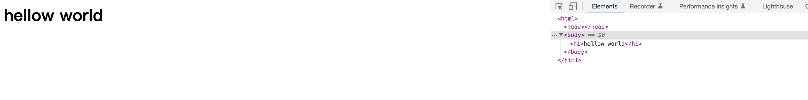

### 什么是HTML

**HTML的全称是：超文本标记语言——HyperText Markup Language。**

每一个网页都是都是由HTML，CSS，JavaScript构成的。HTML是网页的结构和含义，CSS是样式与表现形式，JavaScript就是网页的行为与功能了。举个例子：

像装修房子一样，HTML是毛坯房，CSS是对房屋的装修，而JavaScript就是房子中包含各种各样的功能了。

我们以淘宝首页为例，它的HTML长成下面这样：


html是一种描述性语言，并没有太多的逻辑。但是，却要讲究一定的规则。

### HTML标签

HTML是由一系列的”元素“（标签）组成的。使用不同的标签包裹不同的内容，即可在页面上表现出不同的样子。常见的标签有h1,h2,div,img,video,p,span,a,ul,li,input,form,link,script等等。

- h1标签

以h1标签为例，该标签表示一个一级标题，比如有下面一行文字：
```
hello world
```
我们使用h1标签将其包裹
```
<h1>hellow world</h1>
```
最终，在页面上展示出来如下:



- img标签

再比如，img标签表示图片，我们只需要写入图片的地址，就能在页面上显示一张图片：

```

```


- p标签

p标签表示一个段落。
```
<p>这是一段话</p>
```


- a标签

a标签表示一个链接，可以跳转到其他页面

```
<a href='https://www.baidu.com'>点击我可以跳转到百度<a/> 
```


- ul,li

ul表示一个无序列表，li表示列表里的条目

```
<ul>
    <li>1</li>
    <li>2</li>
    <li>3</li>
</ul>
```


- div标签

**div标签没有任何的语义**。它纯粹就是一个容器，用以包裹其他的元素，可以是文字，也可以是图片。div标签可以说是平时使用得最多的标签了。江湖中不乏【div走天下】的说法。

- html标签

每一个网页最外层都是一对html标签。html标签是网页的根元素。

- body标签

body标签表示网页的内容

- head标签

head标签中，主要是网页的一些基本信息，如网页的名称等。


由于篇幅有限，这里就不再继续介绍各个标签了。可以在这里查看所有的标签：

[传送门](https://developer.mozilla.org/zh-CN/docs/Web/HTML/Element)

### 总结

**一个网页的基本结构，是由许许多多的标签元素组成的。不同的标签，承载了不同的内容**。部分标签是有语义的。所谓语义，就是在html代码层次表达人的想法，告诉浏览器，我这里到底是什么内容。


**简单来说，如果我想放一个链接在网页里，我需要用a标签。如果我想放一段话在网页里，我可以选用p标签。我想放一张图在网页里，我需要用img标签......**

::: warning 注意：
对于有语义的标签，浏览器一般都会有一个默认的表现形式。在不同的浏览器里，同一个标签可能不会长得完全一样，会有一些细微的区别。
:::

不同的标签除了有语义上的区别、表示不同的内容外，Html中的标签也被分为了不同的类型。标签在浏览器中排列方式是有规则的，标签与标签之间是可以互相嵌套的，但是也需要遵循一定的规则。这些内容，将在下一章里继续介绍。

p.s 一直觉得这个纹身挺有意思的：


