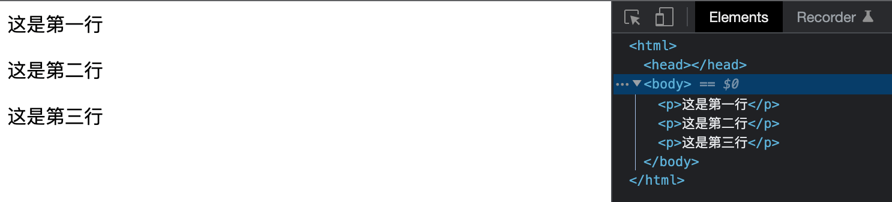
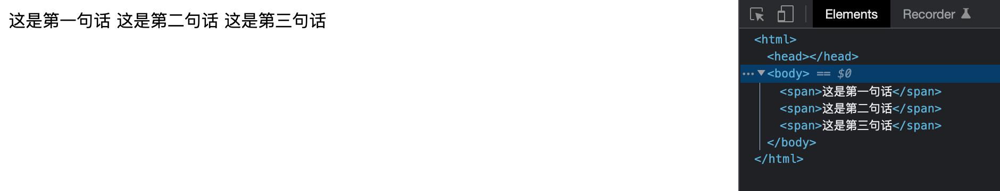
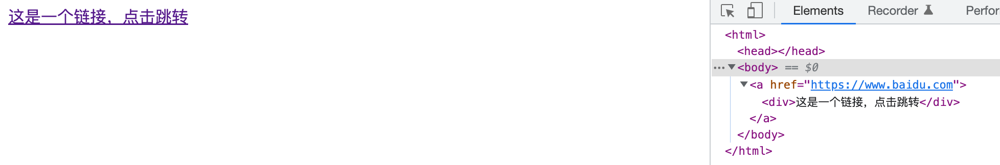
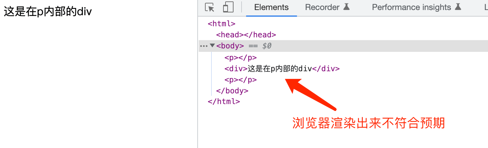

## 块级元素

在上一章里，对HTML进行了初步的描述。我们的网页，就是由一个一个的标签拼接起来组成的。由于输出设备（电脑屏幕，手机屏幕等）在大多数情况下都是竖向滚动的，网页里的标签，默认也是竖向排列的。简单来说，HTML标签排列的时候，大多数标签会占据一行的空间，然后一行一行往下排列。这种标签占据了其父元素的整个水平空间，垂直空间等于其内容的宽度，就像在页面里占据一”块“区域。这样的标签，被称为**块级元素**。针对每一个块级元素，浏览器都会新起一行。

一般情况下，块级元素可以包含行内元素和其他块级元素。常见的块级元素有：div，p，main，section，h1，h2等等



## 内联元素（行内元素）

并非所有的标签都会占据一行。有的标签只会占据一行内的一部分水平空间。这样的标签，被称为**内联元素**。针对内联元素，浏览器不会新起一行。

一般情况下，行内元素只能包含数据和其他行内元素。





以下的元素，都是内联元素，其中标黑的，都是比较常用的：

**a**, **b**, **i**, **button**, **input**, **label**, **select**, **textarea**, **strong**, **em**,
**br**, **img**,**span**, small, tt, abbr, acronym, cite, code, dfn, kbd, , samp, var, big, bdo, , map, object, q, script, , sub, sup


下面是一个块级元素和内联元素混合的例子：


::: warning 注意：
块级元素和内联元素，作为基础内容，在面试中出现的概率不小
:::

## HTML元素的第二种分类

除了块级元素和内联元素的分类，根据元素本身的特点，还可以将元素分成**可替换元素**和**不可替换元素**

可替换元素就是浏览器根据元素的标签和属性，来决定元素的具体显示内容。最常见的，就是img。我们在html代码里看不到img实际的内容，但是浏览器却可以读取图片实际的内容，展示出来。

而不可替换元素，就是直接将元素内容展示出来。例如

```
<span>hello</span>
```
在HTML代码里，能看到 hello，并且hello会被直接展示在屏幕上。


## HTML元素的嵌套规则

HTML元素之间是可以互相嵌套的，上面提到过，**在一般情况下**，块级元素可以包含行内元素和其他块级元素，<del>行内元素只能包含数据和其他行内元素</del>。

::: warning 注意：
经过实测，常见的行内元素是可以包含块级元素的。
:::

```
<div><p></p></div> - ✅

<span>hello world</span> - ✅

<a><span></span></a> - ✅

<a><div></div></a> - ✅

<p><div></div></p> - ❌

<button><div></div></button> - ✅ 这也是可以的

```

这里需要注意的是，a 标签是可以包含 div 标签的。



至于为什么 a 标签可以包含 div 标签（以及其他的一些内联元素可以包含块级元素），主要是由元素自身的 Categories 和 Content Model 决定的。具体讲解和HTML标准可以参考这里：

[传送门](https://www.zhihu.com/question/34952563/answer/60672228)

另外一个需要着重注意的是，**p 标签内部是不能包含 div 标签的**。之前在项目里遇到过这种写法，被坑过。

```
<html>
	<p><div>这是在p内部的div</div></p>
</html>
```



稍微总结一下，关于元素嵌套规则，我们只需要对特殊情况有所记忆就行了，比如 p 内包含 div 是不行的。剩下的情况，一般不会有什么问题。


