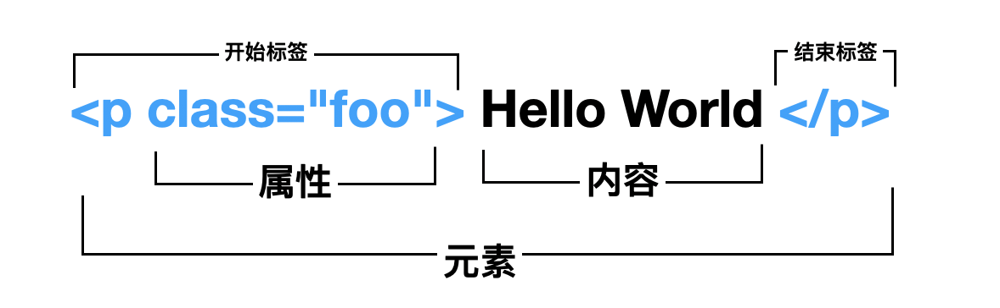
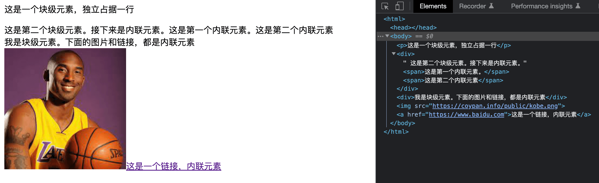
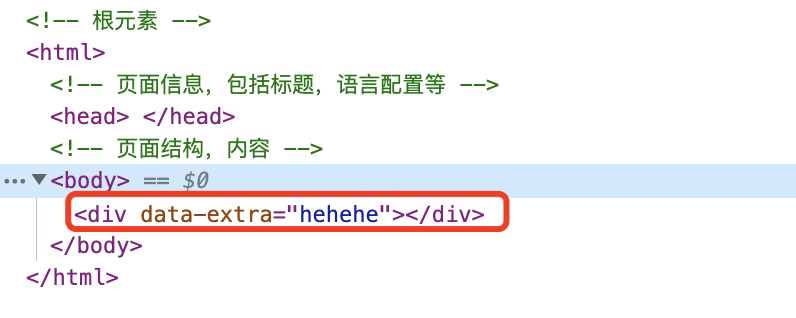

## HTML元素

HTML是网页的基本结构。一个HTML元素的结构如下：



常见的标签有 h1,h2,div,img,video,p,span,a,ul,li,input,form,link,script 等等。

::: warning 注意：
想要查看所有的HTML标签及其用法，请移步这里：[传送门](https://developer.mozilla.org/zh-CN/docs/Web/HTML/Element)
:::

部分标签是自闭合的，即标签内部不能有其他内容。如：

```

<input />
</br>
</hr>
```

## HTML元素的语义

HTML元素是有语义的。语义化的作用：

- 告诉浏览器页面结构与内容, 利于SEO
- 对读屏软件友好，适配无障碍模式

``div``标签是没有特定语义的，只是一个容器。

## HTML文档的结构

每一个HTML文档都有一个固定的基本结构：

```
<!-- 根元素 -->
<html>
	<!-- 页面信息，包括标题，语言配置，引用样式等等 -->
	<head>
		...
	</head>
	<!-- 页面结构，内容 -->
	<body>
		...
	</body>
</html>
```

HTML元素可以嵌套。**但是请记住，p 标签内不能包含 div 标签**。

## HTML元素的分类

按照元素的表现，可以将HTML元素分类两类：**块级元素** 和 **内联元素**。

块级元素在页面中独占一行水平空间。常见的块级元素有：div，p，main，section，h1，h2等等。

内联元素只占据它对应标签的边框所包含的空间，页面中的一行可以有多个内联元素。常见的内联元素有：a, b, i, button, input, label, select, textarea, strong, em, br, img,span等等。



一般情况下，块级元素可以包含行内元素和其他块级元素。常见的行内元素也是可以包含块级元素的。

## HTML元素的属性

HTML元素属性的一般语法如下：

```
<标签名 属性名1="属性值" 属性名2="属性值" ... 属性名N="属性值">内容</标签名>
```

常见的属性有：class, id, style。**HTML元素的属性值均为字符串类型**。

一些内容属性（例如required, readonly, disabled, checked）是布尔值属性。如果一个布尔值属性**存在**，则其值是 true，如果不存在，其值是 false。

可以使用自定义属性在HTML元素上挂载一些自定义的数据。自定义属性一般为"data-*"的格式。HTML元素的所有属性，都可以通过JavaScript操作，这里后续内容会介绍。



网页的无障碍适配依赖 语义化的HTML元素 以及 aria-* 属性。

## 总结

HTML相关的内容不算太多，没有太多的逻辑，主要就是记忆。俗话说孰能生巧，多练，多用，就能记住了，特别是一些常见的标签，需要熟练掌握。

